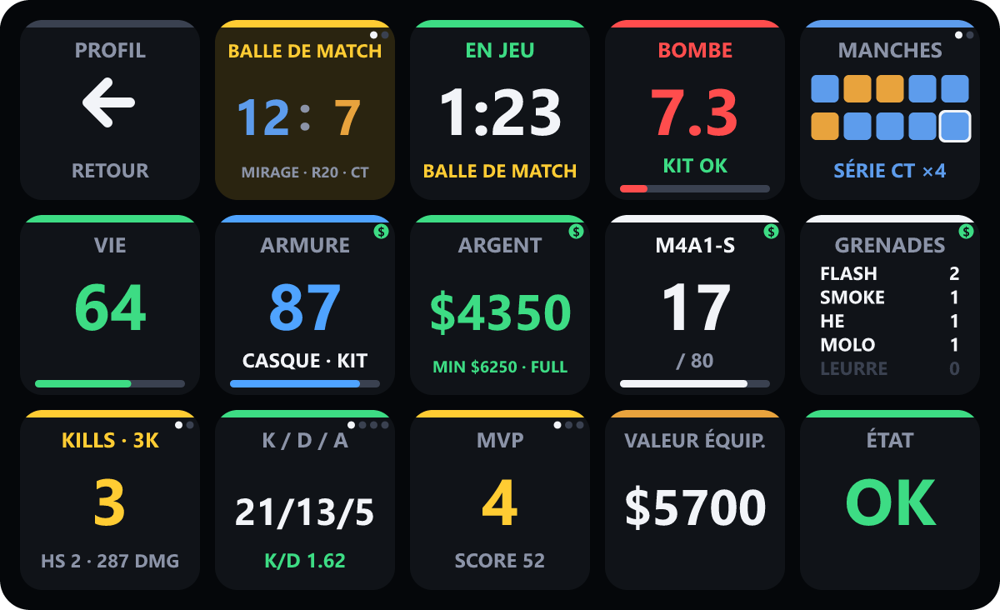
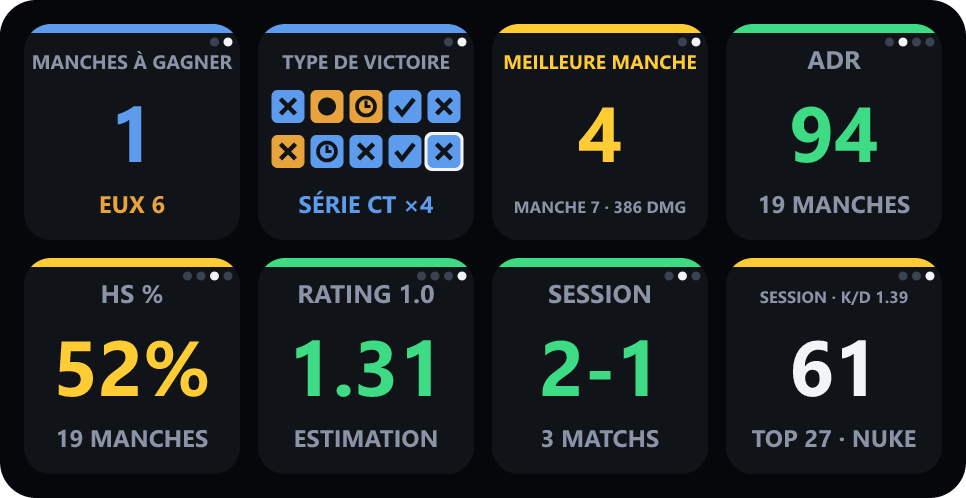
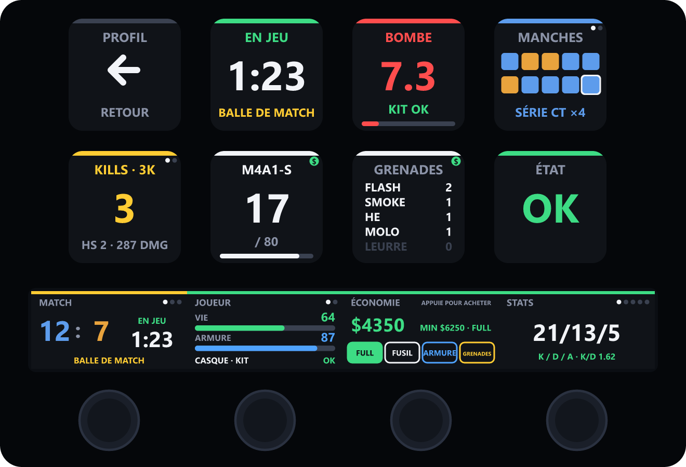

<div align="center">

# CS2 Live Dashboard pour Stream Deck : support

Aide, documentation et signalement de bugs pour **CS2 Live Dashboard**, le tableau de bord Counter-Strike 2 en temps réel pour tous les modèles de Stream Deck.

[English](README.md) · **Français**



</div>

---

## Obtenir de l'aide

- **Un bug ?** [Signale-le](https://github.com/NeuTroNBZh/cs2-live-dashboard-support/issues/new?template=bug_report.yml) (formulaire en anglais, tu peux écrire en français).
- **Une idée ?** [Propose une fonctionnalité](https://github.com/NeuTroNBZh/cs2-live-dashboard-support/issues/new?template=feature_request.yml).
- **Avant de signaler un problème**, consulte la section [Dépannage](#dépannage) ci-dessous et les [problèmes connus](https://github.com/NeuTroNBZh/cs2-live-dashboard-support/issues).

## Installation

1. Récupère **CS2 Live Dashboard** sur [Elgato Marketplace](https://marketplace.elgato.com/stream-deck/plugins) et clique sur **Installer**.
2. Le profil de ton appareil est créé et sélectionné automatiquement.
3. Lance (ou relance) Counter-Strike 2 : les touches s'animent dès que tu rejoins une partie.

> [!NOTE]
> CS2 ne lit les fichiers Game State Integration qu'à son démarrage. Si le jeu était ouvert pendant l'installation, relance-le une fois.

## Fonctionnalités

- **Un profil pour chaque modèle** : l'installation crée un profil adapté à chaque Stream Deck à touches LCD, du Mini (6 touches) au Stream Deck + XL.
- **Écran tactile du Stream Deck +** : quatre panneaux en direct (match, joueur, économie, stats) que l'on parcourt avec les molettes, et une molette pour choisir et acheter son équipement.
- **Bascule automatique** : le tableau de bord s'affiche au lancement de `cs2.exe`, et ton profil précédent revient à la fermeture du jeu.
- **Aucune configuration** : le fichier Game State Integration est installé dans chaque bibliothèque Steam contenant CS2, y compris sur un autre disque.
- **Match en direct** : score avec ton équipe en premier, chrono de phase, historique des manches, bombe au dixième de seconde avec verdict de désamorçage en CT (`KIT OK`, `OK SANS KIT`, `TROP TARD`).
- **État du joueur** : vie, armure, casque et kit, argent, munitions de l'arme active, grenades, flash, feu et fumée.
- **Statistiques** : ADR, pourcentage de headshots, estimation du rating HLTV 1.0, meilleure manche, bilan victoires/défaites de la session.
- **Alertes** : balle de match (pour ou contre toi), dernière manche avant la mi-temps, prolongations.
- **Aide à l'économie** : argent minimum garanti à la manche suivante, avec l'indication `FULL`, `FORCE` ou `ECO`.
- **Achats en une touche** : achat complet, armure, fusil ou grenades directement depuis le deck.
- **Français et anglais** : les touches suivent la langue de l'application Stream Deck.
- **Léger** : aucun accès réseau en dehors de `127.0.0.1`, aucune télémétrie.

## Prérequis

| Composant | Version |
| --- | --- |
| Windows | 10 ou 11 |
| Application Stream Deck | 6.9 ou plus récent |
| Appareil | Tout Stream Deck à touches LCD : MK.2 / Original, Mini, XL, Neo, Studio, +, + XL, Mobile, Virtual Stream Deck, Galleon 100 SD. Voir [Appareils pris en charge](#appareils-pris-en-charge). |
| Counter-Strike 2 | Version Steam |

## Appareils pris en charge

Un profil prêt à l'emploi est créé à l'installation pour chaque modèle de Stream Deck à touches LCD :

| Appareil | Profil | Disposition |
| --- | --- | --- |
| Stream Deck MK.2 / Original, Stream Deck Mobile, Virtual Stream Deck | CS2 Live Dashboard | 5 × 3, les 15 touches |
| Stream Deck Mini | CS2 Live Dashboard Mini | 3 × 2 : retour, score, bombe, phase, vie, argent |
| Stream Deck Neo | CS2 Live Dashboard Neo | 4 × 2 : retour, score, phase, bombe, vie, argent, arme, K/D/A |
| Stream Deck XL | CS2 Live Dashboard XL | 8 × 4, toutes les touches regroupées par thème, avec de la place pour tes propres actions |
| Stream Deck Studio | CS2 Live Dashboard Studio | 16 × 2, toutes les touches |
| Galleon 100 SD | CS2 Live Dashboard Galleon | 3 × 4, les 12 touches les plus utiles |
| Stream Deck + | CS2 Live Dashboard+ | 4 × 2 touches et 4 panneaux de molettes |
| Stream Deck + XL | CS2 Live Dashboard+ XL | 9 × 4 touches et 4 panneaux de molettes |

Le profil correspondant s'ouvre automatiquement sur chaque appareil au lancement de CS2. La Stream Deck Pedal et les touches G Corsair n'ont pas d'écran : pas de profil pour elles, mais tu peux quand même leur attribuer les actions d'achat.

## Disposition

| | | | | |
| :---: | :---: | :---: | :---: | :---: |
| **Retour** | **Score** | **Phase et chrono** | **Bombe** | **Historique** |
| **Vie** | **Armure** 💲 | **Argent** 💲 | **Arme et munitions** 💲 | **Grenades** 💲 |
| **Kills de la manche** | **K/D/A et stats** | **MVP et session** | **Valeur de l'équipement** | **État** |

💲 = appui pour acheter (voir [Achats en une touche](#achats-en-une-touche)). Toutes les actions sont aussi dans la liste des actions Stream Deck, catégorie **CS2 Live Dashboard**, pour composer ta propre disposition.

Quand le jeu n'est pas lancé, les touches affichent `CS2 · HORS LIGNE`, et `MENU` dans le menu principal.

## Interactions

Les touches qui ont plusieurs vues affichent des petits points en haut à droite. Un appui passe à la vue suivante.

| Touche | Vues |
| --- | --- |
| Score | Score → manches restantes pour gagner, pour chaque équipe |
| Historique | Camp vainqueur → type de victoire (élimination, bombe, désamorçage, temps) |
| Kills de la manche | Manche en cours → meilleure manche du match |
| K/D/A | K/D/A → ADR → HS % → estimation du rating |
| MVP | MVP et score → bilan de la session → kills de la session et meilleur match |
| Retour | Revient au profil utilisé avant |

<div align="center">

</div>

## Stream Deck +

<div align="center">

</div>

Le profil Stream Deck + place 8 touches au-dessus de l'écran tactile, et chaque molette a son propre panneau en direct :

| Molette | Rotation | Appui ou toucher de l'écran |
| --- | --- | --- |
| Match | Score et chrono → historique avec types de victoire → manches restantes | Vue suivante |
| Joueur | Vie, armure et état → arme, munitions et grenades | Vue suivante |
| Économie | Choix de l'achat : full buy, fusil, armure, grenades | Achète l'élément sélectionné (✓ confirme) |
| Stats | K/D/A → ADR et HS % → rating et meilleure manche → MVP et score → session | Vue suivante |

Les quatre panneaux sont aussi disponibles séparément dans la liste des actions, pour les placer sur n'importe quelle molette.

## Achats en une touche

Les touches marquées d'un badge vert `$` achètent pendant la phase d'achat :

| Touche | Achat | Bind CS2 |
| --- | --- | --- |
| Argent | Fusil, armure + casque, kit, toutes les grenades | `KP_MULTIPLY` (`*` du pavé numérique) |
| Armure | Armure + casque, kit (CT) | `KP_MINUS` (`-` du pavé numérique) |
| Arme | AK-47 ou la M4 de ton inventaire | `KP_PLUS` (`+` du pavé numérique) |
| Grenades | Smoke, flash, molotov / incendiaire, HE | `KP_DIVIDE` (`/` du pavé numérique) |

CS2 n'accepte pas les touches F13 à F24 dans les binds. Le plugin écrit donc ces binds dans `streamdeck_buy.cfg` et ajoute une seule ligne, `exec streamdeck_buy`, à la fin de ton `autoexec.cfg`. Ton `autoexec.cfg` d'origine est sauvegardé une fois sous le nom `autoexec.cfg.bak-streamdeck`. À l'appui, le plugin envoie la touche correspondante à la fenêtre active, comme le ferait un clavier à macros.

> [!IMPORTANT]
> Si tu utilises déjà ces quatre touches du pavé numérique dans CS2, les binds d'achat les remplacent. La fenêtre du jeu doit être au premier plan au moment de l'appui.

## Fonctionnement

```
Counter-Strike 2 ──(Game State Integration, HTTP POST)──▶ 127.0.0.1:3131 ──▶ plugin ──▶ touches Stream Deck
```

- [Game State Integration](https://developer.valvesoftware.com/wiki/Counter-Strike:_Global_Offensive_Game_State_Integration) est l'interface officielle de Valve pour envoyer les données de match à des outils locaux (overlays de diffusion, éclairage RGB…). Elle ne donne que ce que ton client affiche déjà, jamais la position des adversaires. Elle est compatible VAC.
- Le plugin installe `gamestate_integration_streamdeck_dashboard.cfg` dans `…/Counter-Strike Global Offensive/game/csgo/cfg/` à chaque démarrage.
- Le serveur local n'écoute que sur `127.0.0.1` et ignore les requêtes sans le jeton du plugin.
- Les statistiques du match et de la session sont calculées manche par manche et restent en mémoire : elles repartent de zéro au redémarrage du plugin.
- Le rating est une estimation fondée sur la formule publique HLTV 1.0, à partir des données que CS2 fournit au joueur.

## Dépannage

<details>
<summary><b>Les touches restent sur « HORS LIGNE »</b></summary>

1. Relance Counter-Strike 2 après l'installation du plugin.
2. Vérifie que `gamestate_integration_streamdeck_dashboard.cfg` est présent dans `Steam/steamapps/common/Counter-Strike Global Offensive/game/csgo/cfg/`.
3. Vérifie qu'aucun autre programme n'utilise le port TCP `3131` : `netstat -ano | findstr :3131`.
4. Consulte le journal du plugin : `%APPDATA%\Elgato\StreamDeck\Plugins\com.neutronbzh.cs2dashboard.sdPlugin\logs\`.

</details>

<details>
<summary><b>Le profil n'a pas été créé</b></summary>

Le profil est fourni pour le Stream Deck 15 touches et Stream Deck Mobile. Sur les autres modèles, glisse les actions de la catégorie **CS2 Live Dashboard** sur n'importe quel profil. Réinstaller le plugin relance aussi l'import du profil.

</details>

<details>
<summary><b>Les touches d'achat ne font rien</b></summary>

- Les achats ne marchent que pendant la phase d'achat, dans la zone d'achat.
- La fenêtre de CS2 doit être au premier plan, ce qui est le cas quand tu joues avec Stream Deck Mobile ou un deck physique.
- Vérifie que `exec streamdeck_buy` est bien dans ton `autoexec.cfg`. Tu peux aussi taper `exec streamdeck_buy` une fois dans la console.
- **CS2 ne doit pas tourner en administrateur.** Windows bloque les touches envoyées aux programmes lancés avec les droits administrateur : les touches d'achat affichent alors un avertissement (⚠) au lieu d'une coche. Ça arrive quand Steam est lancé en administrateur, ou depuis un script lancé en administrateur. Ferme Steam et relance-le normalement.
- Certains anti-cheats de plateformes tierces bloquent les touches simulées. Le reste du tableau de bord fonctionne quand même.

</details>

<details>
<summary><b>Les chronos semblent un peu décalés</b></summary>

CS2 n'envoie pas les chronos de phase aux joueurs (seulement aux spectateurs) : le plugin les estime à partir des changements de phase. Il apprend le vrai freeze time du serveur au fil des manches, affiche « — » pour le premier freeze time d'une mi-temps (plus long à cause de la présentation des équipes) tant qu'il n'en a pas mesuré un, ajoute 30 secondes quand une équipe prend un temps mort tactique, et masque un chrono qui dépasse son estimation, par exemple pendant une pause d'admin. Le chrono de la bombe utilise la mèche standard de 40 secondes.

</details>

## Désinstallation

1. Dans Stream Deck, clic droit sur **CS2 Live Dashboard** dans la liste des actions, puis **Désinstaller**. Supprime ensuite le profil si tu n'en as plus besoin.
2. Supprime `gamestate_integration_streamdeck_dashboard.cfg` et `streamdeck_buy.cfg` du dossier `cfg` de CS2.
3. Retire la ligne `exec streamdeck_buy` de `autoexec.cfg`, ou restaure `autoexec.cfg.bak-streamdeck`.

## Mentions

Ce dépôt contient uniquement la documentation et le suivi des problèmes ; le plugin est distribué sur Elgato Marketplace.

Counter-Strike et Steam sont des marques de Valve Corporation. Stream Deck est une marque de Corsair Gaming, Inc. CS2 Live Dashboard n'est ni affilié, ni approuvé, ni sponsorisé par Valve Corporation ou Corsair Gaming, Inc.
