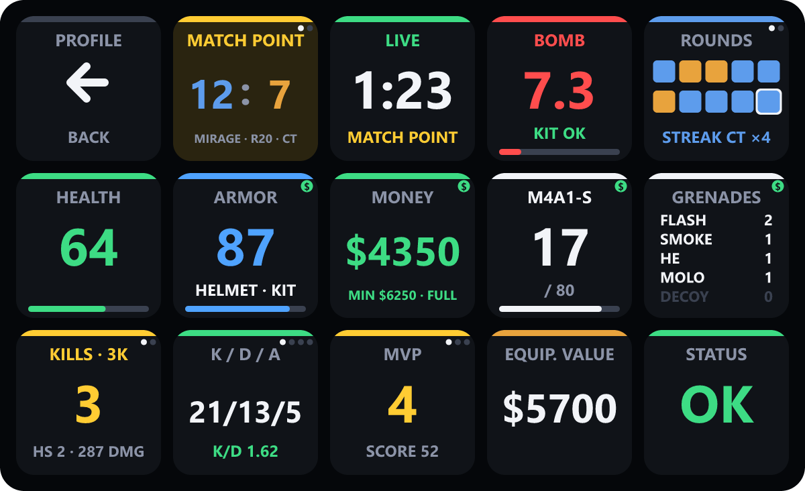
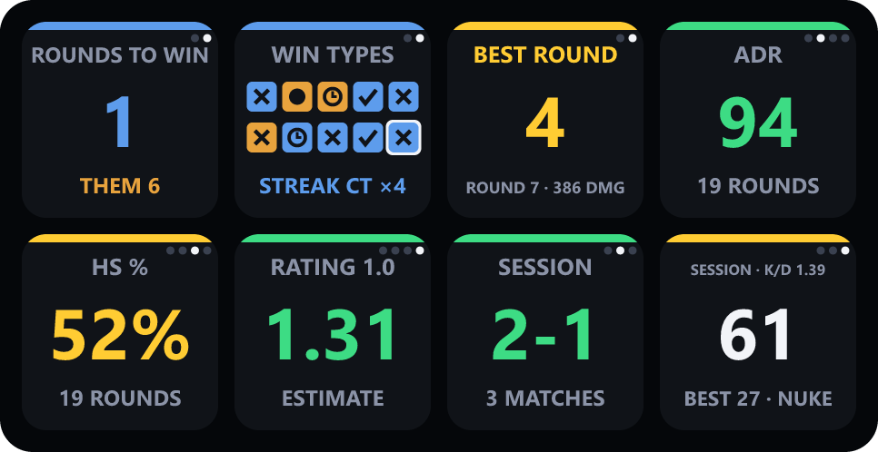
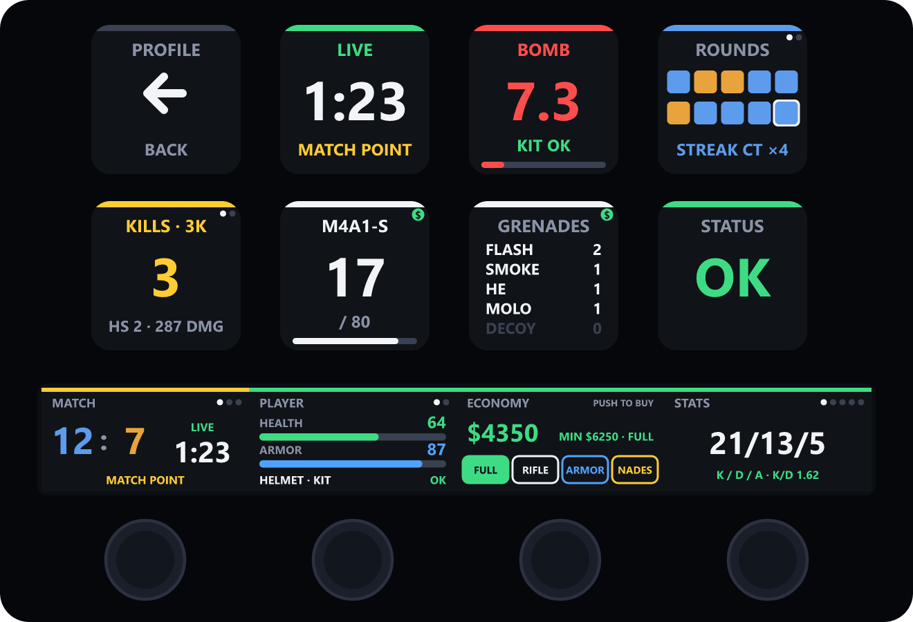

<div align="center">

# CS2 Live Dashboard for Stream Deck: Support

Help, documentation and bug reports for **CS2 Live Dashboard**, the real-time Counter-Strike 2 dashboard for every Stream Deck model.

**English** · [Français](README.fr.md) · [Get it on Elgato Marketplace](https://marketplace.elgato.com/maker/neutronbzh)



</div>

---

## Getting help

- **Found a bug?** [Open a bug report](https://github.com/NeuTroNBZh/cs2-live-dashboard-support/issues/new?template=bug_report.yml).
- **Have an idea?** [Suggest a feature](https://github.com/NeuTroNBZh/cs2-live-dashboard-support/issues/new?template=feature_request.yml).
- **Before reporting**, check the [troubleshooting](#troubleshooting) section below and the [known issues](https://github.com/NeuTroNBZh/cs2-live-dashboard-support/issues).

## Installation

1. Open the [NeuTroNBZh page on Elgato Marketplace](https://marketplace.elgato.com/maker/neutronbzh), choose **CS2 Live Dashboard** and click **Install**.
2. The profile for your device is created and selected automatically.
3. Start (or restart) Counter-Strike 2. The keys light up as soon as you join a match.

> [!NOTE]
> CS2 only reads Game State Integration files at launch. If the game was already running during installation, restart it once.

## Features

- **Ready-made profiles for every model**: installing the plugin creates a profile tailored to each Stream Deck with LCD keys, from the 6-key Mini to the Stream Deck + XL.
- **Stream Deck + touch strip**: four live panels (match, player, economy, stats) that you browse with the dials, and a dial to pick and buy equipment.
- **Automatic switching**: the dashboard opens when `cs2.exe` starts and your previous profile comes back when the game closes.
- **Zero configuration**: the Game State Integration file is installed into every CS2 library found on the machine, including custom Steam library locations.
- **Live match view**: score with your team first, phase timer, round history and a bomb countdown to the tenth of a second, with a defuse verdict (`KIT OK`, `OK WITHOUT KIT`, `TOO LATE`) when you play CT.
- **Player state**: health, armor, helmet and kit, money, active weapon ammo, grenades, flash, fire and smoke status.
- **Match statistics**: ADR, headshot percentage, an HLTV 1.0 rating estimate, best round, and session wins/losses across matches.
- **Match alerts**: match point (yours or theirs), last round before halftime, overtime.
- **Economy helper**: the minimum money guaranteed next round, tagged `FULL`, `FORCE` or `ECO`.
- **One-press buys**: full buy, armor, rifle or utility straight from the deck.
- **English and French**: the keys follow the Stream Deck application language.
- **Lightweight**: no network access beyond `127.0.0.1`, no telemetry, no background service.

## Requirements

| Component | Version |
| --- | --- |
| Windows | 10 or 11 |
| Stream Deck app | 6.9 or later |
| Device | Any Stream Deck with LCD keys: MK.2 / Original, Mini, XL, Neo, Studio, +, + XL, Mobile, Virtual Stream Deck, Galleon 100 SD. See [Supported devices](#supported-devices). |
| Counter-Strike 2 | Steam version |

## Supported devices

A ready-made profile is created on installation for every Stream Deck model with LCD keys:

| Device | Profile | Layout |
| --- | --- | --- |
| Stream Deck MK.2 / Original, Stream Deck Mobile, Virtual Stream Deck | CS2 Live Dashboard | 5 × 3, all 15 keys |
| Stream Deck Mini | CS2 Live Dashboard Mini | 3 × 2: back, score, bomb, phase, health, money |
| Stream Deck Neo | CS2 Live Dashboard Neo | 4 × 2: back, score, phase, bomb, health, money, weapon, K/D/A |
| Stream Deck XL | CS2 Live Dashboard XL | 8 × 4, all keys grouped by topic, free space for your own actions |
| Stream Deck Studio | CS2 Live Dashboard Studio | 16 × 2, all keys |
| Galleon 100 SD | CS2 Live Dashboard Galleon | 3 × 4, the 12 most useful keys |
| Stream Deck + | CS2 Live Dashboard+ | 4 × 2 keys and 4 dial panels |
| Stream Deck + XL | CS2 Live Dashboard+ XL | 9 × 4 keys and 4 dial panels |

The matching profile opens automatically on each device when CS2 starts. Stream Deck Pedal and Corsair G-keys have no screen, so no profile is provided for them, but you can still assign the buy actions to them.

## Layout

| | | | | |
| :---: | :---: | :---: | :---: | :---: |
| **Back** | **Score** | **Phase & timer** | **Bomb** | **Round history** |
| **Health** | **Armor** 💲 | **Money** 💲 | **Weapon & ammo** 💲 | **Grenades** 💲 |
| **Round kills** | **K/D/A & stats** | **MVP & session** | **Equipment value** | **Status** |

💲 = press to buy (see [One-press buys](#one-press-buys)). Every action is also available in the Stream Deck action list under **CS2 Live Dashboard**, so you can build your own layout.

When the game is not running the keys show `CS2 · OFFLINE`, and `MENU` while you are in the main menu.

## Key interactions

Keys with several views show small dots in their top-right corner. Press the key to go to the next view.

| Key | Views |
| --- | --- |
| Score | Score → rounds left to win for each team |
| Round history | Winning side → how each round was won (elimination, bomb, defuse, time) |
| Round kills | Current round → best round of the match |
| K/D/A | K/D/A → ADR → HS % → rating estimate |
| MVP | MVP & score → session wins/losses → session kills and best match |
| Back | Returns to the profile you were using before |

<div align="center">

</div>

## Stream Deck +

<div align="center">

</div>

The Stream Deck + profile puts 8 keys above the touch strip and gives each dial its own live panel:

| Dial | Rotate | Push or tap the screen |
| --- | --- | --- |
| Match | Score & timer → round history with win types → rounds left to win | Next view |
| Player | Health, armor & status → weapon, ammo & grenades | Next view |
| Economy | Choose what to buy: full buy, rifle, armor, utility | Buy the selected item (✓ confirms) |
| Stats | K/D/A → ADR & HS % → rating & best round → MVP & score → session | Next view |

The four panels are also available individually in the action list, so you can place them on any dial.

## One-press buys

Keys with a green `$` badge buy equipment when pressed during the buy period:

| Key | Buys | CS2 bind |
| --- | --- | --- |
| Money | Rifle, armor + helmet, defuse kit, full utility | `KP_MULTIPLY` (numpad `*`) |
| Armor | Armor + helmet, defuse kit (CT) | `KP_MINUS` (numpad `-`) |
| Weapon | AK-47 or your M4 loadout variant | `KP_PLUS` (numpad `+`) |
| Grenades | Smoke, flash, molotov / incendiary, HE | `KP_DIVIDE` (numpad `/`) |

CS2 does not accept F13–F24 in binds, so the plugin writes these binds to `streamdeck_buy.cfg` and adds one line, `exec streamdeck_buy`, at the end of your `autoexec.cfg`. Your original `autoexec.cfg` is backed up once as `autoexec.cfg.bak-streamdeck`. When you press a buy key, the plugin sends the matching numpad keystroke to the focused window, just like a macro keyboard would.

> [!IMPORTANT]
> If you already use these four numpad keys in CS2, the buy binds will replace them. The game window must have focus when you press a buy key.

## How it works

```
Counter-Strike 2 ──(Game State Integration, HTTP POST)──▶ 127.0.0.1:3131 ──▶ plugin ──▶ Stream Deck keys
```

- [Game State Integration](https://developer.valvesoftware.com/wiki/Counter-Strike:_Global_Offensive_Game_State_Integration) is Valve's official interface for sending match data to local tools. It is also used by broadcast overlays and RGB lighting software, and it only exposes information your own client already displays, never enemy positions. It is safe to use with VAC.
- The plugin installs `gamestate_integration_streamdeck_dashboard.cfg` into `…/Counter-Strike Global Offensive/game/csgo/cfg/` every time it starts.
- The local server only listens on `127.0.0.1` and ignores requests without the plugin's token.
- Match statistics and session results are computed from the round-by-round data and kept in memory. Restarting the plugin resets them.
- The rating is an estimate based on the public HLTV 1.0 formula, built from the data CS2 exposes to players.

## Troubleshooting

<details>
<summary><b>The keys stay on "OFFLINE"</b></summary>

1. Restart Counter-Strike 2 after installing the plugin.
2. Check that `gamestate_integration_streamdeck_dashboard.cfg` exists in `Steam/steamapps/common/Counter-Strike Global Offensive/game/csgo/cfg/`.
3. Make sure no other program uses TCP port `3131`: `netstat -ano | findstr :3131`.
4. Open the plugin log: `%APPDATA%\Elgato\StreamDeck\Plugins\com.neutronbzh.cs2dashboard.sdPlugin\logs\`.

</details>

<details>
<summary><b>The profile was not created</b></summary>

Profiles are provided for the 15-key Stream Deck and Stream Deck Mobile. On other models, drag the actions from the **CS2 Live Dashboard** category onto any profile. You can also reinstall the plugin to trigger the profile import again.

</details>

<details>
<summary><b>Buy keys do nothing</b></summary>

- Buys only work during the buy period and inside the buy zone.
- The CS2 window must be focused (this is the default when you use Stream Deck Mobile or a physical deck while playing).
- Check that `exec streamdeck_buy` is present in your `autoexec.cfg`. You can also run `exec streamdeck_buy` once in the console.
- **CS2 must not run as administrator.** Windows blocks keystrokes sent to programs running with administrator rights, so buy keys show a warning sign (⚠) instead of a check mark. This happens when Steam is started as administrator or from a script running as administrator. Close Steam and start it normally.
- Some anti-cheat clients for third-party platforms block simulated keystrokes. The dashboard itself keeps working.

</details>

<details>
<summary><b>The timers look slightly off</b></summary>

CS2 does not send phase timers to players (only to spectators), so the plugin estimates them from phase changes. It learns the real freeze time of each server as rounds go by, shows "—" for the first freeze time of a half (team intros make it longer) until it has measured one, adds 30 seconds when a team calls a tactical timeout, and hides a timer that runs past its estimate, for example during an admin pause. The bomb timer uses the standard 40-second fuse.

</details>

## Uninstalling

1. In Stream Deck, right-click **CS2 Live Dashboard** in the action list and choose **Uninstall**, then delete the profile if you no longer need it.
2. Delete `gamestate_integration_streamdeck_dashboard.cfg` and `streamdeck_buy.cfg` from the CS2 `cfg` folder.
3. Remove the `exec streamdeck_buy` line from `autoexec.cfg`, or restore `autoexec.cfg.bak-streamdeck`.

## Disclaimer

This repository only hosts documentation and issue tracking; the plugin is distributed through Elgato Marketplace.

Counter-Strike and Steam are trademarks of Valve Corporation. Stream Deck is a trademark of Corsair Gaming, Inc. CS2 Live Dashboard is not affiliated with, endorsed by, or sponsored by Valve Corporation or Corsair Gaming, Inc.
